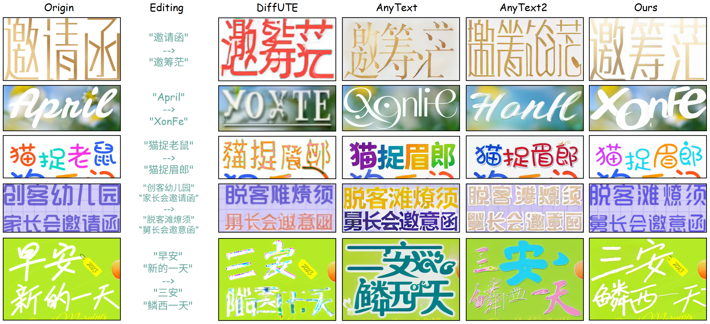

<h2 align="center">UTDesign: A Unified Framework for Stylized Text Editing and Generation in Graphic Design Images</h2>
<p align="center">
  <a href=""></a>
  <a href=''></a>
  <a href=''></a>

<p align="center"></p>

<span style="font-size: 12px; font-weight: 400;">UTDesign supports editing arbitrary stylized text in design images (A) as well as generating complete design images (B). On the left side, we illustrate the pipeline for the two tasks, while the right side showcases the results of UTDesign across three different applications: (1) stylized text editing, (2) conditional stylized text generation, and (3) full design image generation.</span>

<!-- Features -->
## 🌟 Features
- **Style-preserved Text Editing**: Accept arbitrary number of glyph style references for glyph style transfer with the help of a CLIP-based style encoder.
- **Accurate Bilingual Glyph Generation**: Supports accurate glyph generation (especially Chinese glyphs) with diffusion models using DINOv2-based visual conditioning.
- **RGBA Forground Output**: Supports 4-channel (RGBA) forground glyph image outputs for flexible usage based on transparency VAE decoding.


<!-- TODO List -->
## 🚧 TODO List
- [x] Release inference pipelines.
- [x] Release gradio demo.
- [ ] Release training instructions.


<!-- Environment Setup -->
## 🛠️ Environment Setup
### Pull the Docker Image
```bash
docker pull zympku/diffdev:v4_release
```

### Clone the Repositary

```bash
cd /your/workdir
git clone https://github.com/ZYM-PKU/UTDesign.git
```

### Create Docker Container
```bash
sudo docker run --name utdesign --gpus=all -it --ipc=host --network=host -v /your/workdir:/workspace -w /workspace/UTDesign zympku/diffdev:v4_release /bin/bash
```

<!-- Download Model Weights -->
## ⬇️ Download Model Weights
Download the checkpoints using `Huggineface CLI`:
```
huggingface-cli download xxx --local-dir checkpoints
```

The downloaded checkpoints should be organized as follows:
```
checkpoints/
├── tools/
│   ├── big-lama
│   │   ├── models
|   |   |   └── best.ckpt
│   │   └── config.yaml
│   └── yolo.pt
└── utdesign_l16+8_lora64_res256/
    ├── fusion_module
    |   ├── config.json
    |   └── diffusion_pytorch_model.safetensors
    ├── trans_vae
    |   ├── config.json
    |   └── diffusion_pytorch_model.safetensors
    ├── transformer
    |   ├── config.json
    |   └── diffusion_pytorch_model.safetensors
    └── pytorch_lora_weights.safetensors
```


## ▶️ Inference Pipelines
### Stylized text editing
<p align="center"></p>

- Run the following command to try stylized text editing on given examples:
```bash
python test_edit.py
```

- To try it on your own data, first arrange your cases as in `assets/edit_cases.json` and run the following command:
```bash
python test_edit.py --anno_path /path/to/your/json
```

### Full design image generation
<p align="center"></p>

- Run the following command to try full design image generation on given examples:
```bash
python test_full_gen.py
```

- To try it on your own data, first arrange your cases as in `assets/full_gen_cases.json` and run the following command:
```bash
python test_full_gent.py --anno_path /path/to/your/json
```

## 🕹️ Gradio Demo
- Run the following command to create a demo page hosted on your local machine:
```
python app.py
```

## 🧪 Training Instructions
Coming soon...

## 🎉 Acknowledgement
- Datasets: We sincerely appreciate [Kingsoft](www.kingsoft.com) Corporation for providing part of the data with fine-grained annotations.
- Code & Model: Our project is built based on the [diffusers](https://github.com/huggingface/diffusers) code base and we leverage the weights of [FLUX](https://github.com/black-forest-labs/flux) VAE.

### 🪬 Citation

```
```